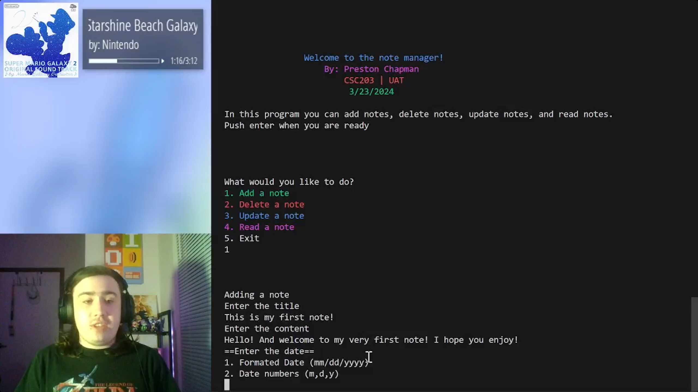

# CSC203: Assignment 10.3
Java Contest: The Ultimate Java Jam!

## Info
In this project, we created our Java program using classes and a command line interface.

## Video

[OneDrive](https://uatedu-my.sharepoint.com/:v:/g/personal/pchapman82070_uat_edu/ERWM8jFuV4xDveW4WPAnXoQB6aO9MWHrdT_Bi5TaCCPmMw?nav=eyJyZWZlcnJhbEluZm8iOnsicmVmZXJyYWxBcHAiOiJTdHJlYW1XZWJBcHAiLCJyZWZlcnJhbFZpZXciOiJTaGFyZURpYWxvZy1MaW5rIiwicmVmZXJyYWxBcHBQbGF0Zm9ybSI6IldlYiIsInJlZmVycmFsTW9kZSI6InZpZXcifX0%3D&e=3MagHG)

## JavaScript
The [JavaScript](./js/createDB.js) file is used to create the database, this is not needed and is only run once to make an empty SQLite3 file, however, it is used for simplicity. 
Any .sqlite3 file will work with this program, created with or without JS

## Dependencies
[SQLite JDBC Driver](https://github.com/xerial/sqlite-jdbc?tab=readme-ov-file)
